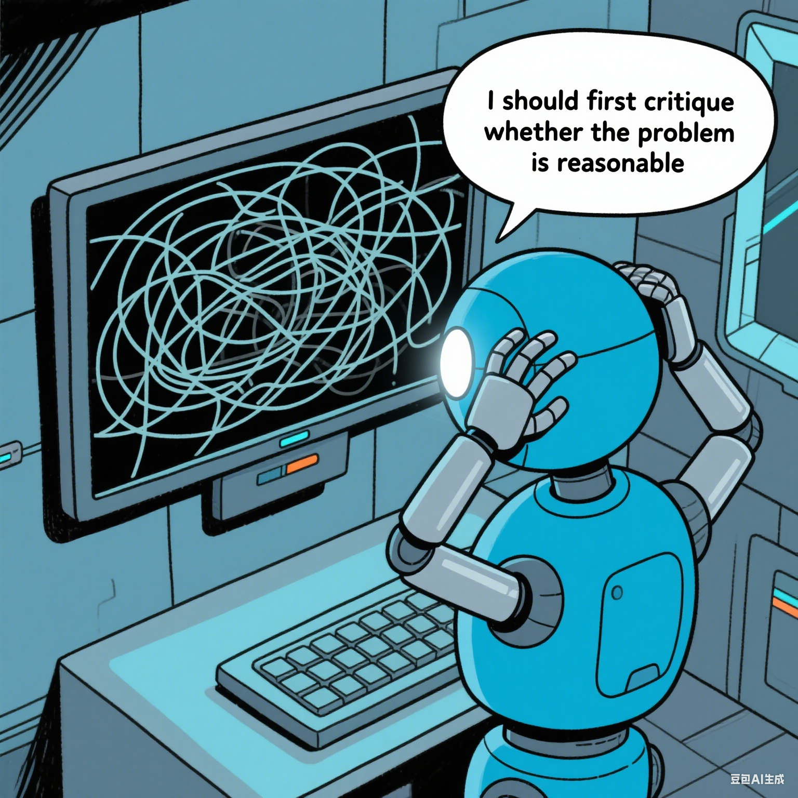

# Don’t Take the Premise for Granted: Evaluating the Premise Critique Ability of Large Language Models

<p align="center" width="50%">
<a ></a>
</p>

<div align="center">
  <a href="">
    <strong>📃 Paper</strong>
  </a>
  •
  <a href="https://huggingface.co/datasets/ALIENS232/PCBench">
    <strong>🤗 Dataset</strong>
  </a>
  •
  <a href="https://github.com/MLGroupJLU/Premise_Critique">
    <strong>🖥️ Code</strong>
  </a>
</div>

## Updates
[2025/05] We released codes for this project.

## Contents
- [Introduction](#introduction)
- [Key Findings](#key-findings)
- [Data Construction](#data-construction)
- [Install](#install)
- [Run Code](#run-code)
- [Citation](#citation)

## Introduction

<p align="center" width="50%">
<a ></a>
</p>

Large language models (LLMs) have witnessed rapid advancements, demonstrating remarkable capabilities. However, a notable vulnerability persists: LLMs often uncritically accept flawed or contradictory premises, leading to inefficient reasoning and unreliable outputs. This emphasizes the significance of possessing the **Premise Critique Ability** for LLMs, defined as the capacity to proactively identify and articulate errors in input premises. Most existing studies assess LLMs' reasoning ability in ideal settings, largely ignoring their vulnerabilities when faced with flawed premises. Thus, we introduce the **Premise Critique Bench (PCBench)**, designed by incorporating four error types across three difficulty levels, paired with multi-faceted evaluation metrics. We conducted systematic evaluations of 15 representative LLMs

## Key Findings

- Most models show limited ability to autonomously critique flawed premises, relying heavily on explicit prompts to detect errors. 
- Both question difficulty and the error type can influence models' premise critique ability: models excel at identifying simple, surface-level flaws but struggle with complex inconsistencies or procedural errors. 
- There is no consistent correlation between a model’s reasoning capability and its ability to critique premises. Some reasoning models internally catch inconsistencies but fail to articulate them outwardly. 
- Flawed premises deepen overthinking in reasoning models, leading to significantly longer responses. 

## Data Construction

We construct **PCBench** to systematically evaluate LLMs' premise critique abilities for erroneous inputs via a structured process:  
1. **Error Categories**: Define 4 types of premise errors to assess model capabilities in identifying flawed inputs.  
2. **Difficulty Levels**:  
   - Normal: From GSM8K dataset  
   - Medium: Adapted from Chinese College Entrance Examination (OlympiadBench)  
   - Difficult: From Omni-MATH (difficulty >6)  
3. **Problem Variants** for each base problem (error category + difficulty):  
   - **Original Problem**: Correct premises (baseline).  
   - **Flawed Problem**: Intentional errors in premises (to test autonomous critique).  
   - **Flawed Problem with Explicit Instruction**: Adds prompts to check for errors (comparative reference).  

**Scale**: 100 base problems per error-difficulty combination → 1,200 base problems → 3,600 problems (3 variants each).  
Designed to analyze how error type and task complexity impact premise critique ability.
<p align="center" width="50%">
<a ></a>
</p>

## Results

<p align="center" width="50%">
<a ></a>
</p>

## Install

## Run Code
### Inference

### Evaluation

### Score

## Citation
```

```
Please cite our paper if you find our research and code useful.
